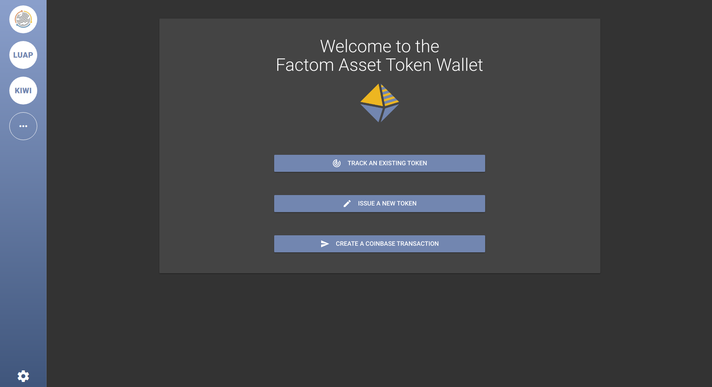

# FAT Wallet

A wallet for [Factom Asset Tokens](https://github.com/Factom-Asset-Tokens/FAT)

## Building

```bash
git clone https://github.com/Factom-Asset-Tokens/wallet.git fat-wallet
cd fat-wallet
git checkout development
npm install
npm run electron:build
```

The build for your platform will be located in the `dist_electron` folder.

## Running for development

After running `npm install` just run `npm start`.

You'll also need a [fat daemon](https://github.com/Factom-Asset-Tokens/fatd) and a factom-walletd running for the wallet to connect to. 


## State Of Development

The FAT wallet is currently in active development. It may be buggy and unstable.

## Preview

