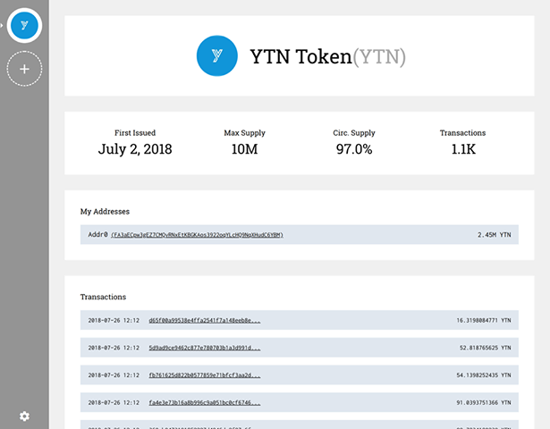

# FATWallet

A wallet for [Factom Asset Tokens](https://github.com/DBGrow/FAT)




## Installation

Command Line:

```
git clone https://github.com/DBGrow/FATWallet.git
cd FATWallet
npm install
cd fat-js
npm install
```


## Running

First, Run a Factomd node on your localhost with API port 8088 accessible (configurable host coming in the near future!).

In the `FATWallet` directory:

```
npm start
```

A browser window should pop up pointing to http://localhost:3000. If not, you can use any browser to view the wallet :smile:


## State Of Development

Follow along with the [project board](https://github.com/DBGrow/FATWallet/projects/1) to stay up to date!

Things to be done ASAP:

- Factoid address / Identity management UI
- Real time transaction updates on UI (was working before update :cry:)
- Issue token page
- Packaging into executable ([pkg](https://github.com/zeit/pkg))
- Guides & How To